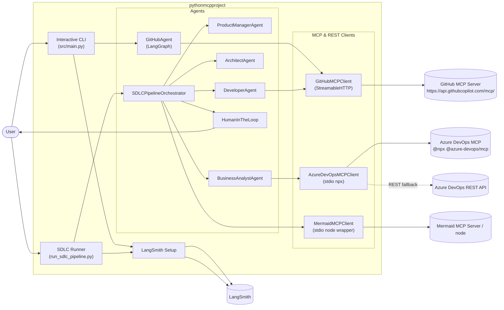
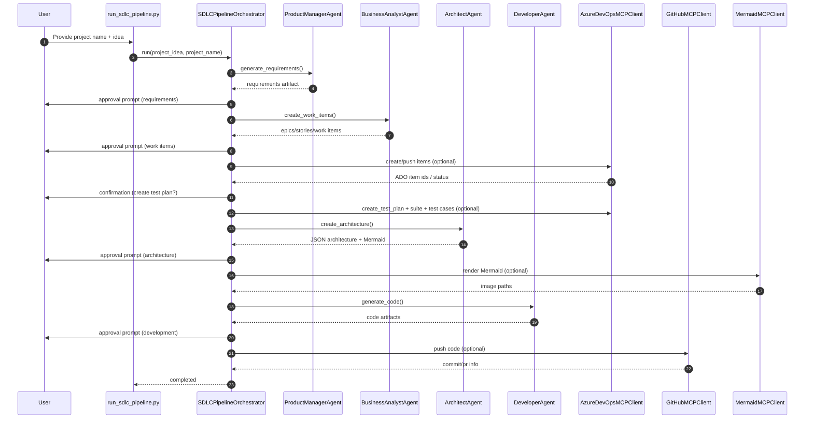

# Platform Architecture & Design (pythonmcpproject)

## 1. Purpose
This document describes the platform architecture, major components, runtime flows, and third‑party integrations for this repository.

The repo supports **two primary execution modes**:
1. **Interactive GitHub MCP Agent**: `python src/main.py`
2. **Multi‑agent SDLC pipeline** (Product → BA → Architect → Developer): `python run_sdlc_pipeline.py`

---

## 2. System Overview

### 2.1 High-level Concept
This is an **LLM-driven orchestration layer** that:
- Uses **LangGraph** (for the GitHub agent) and a custom orchestrator (for the SDLC pipeline)
- Calls external systems via **MCP servers** (GitHub over HTTP; Azure DevOps over stdio)
- Emits **observability traces** to **LangSmith** when enabled

### 2.2 Key Non-Functional Priorities
- **Determinism where possible**: tool calling boundaries, explicit step gating, capped tool loops
- **Operational clarity**: logs + optional traces
- **Safe-by-default**: human approval gates in SDLC pipeline; scripts default to dry-run

---

## 3. Component Model

### 3.1 Components (Runtime)

**CLI Entrypoints**
- `src/main.py`: interactive GitHub agent loop
- `run_sdlc_pipeline.py`: interactive SDLC pipeline runner (approvals, prompts)

**Agent Layer**
- `src/agents/github_agent.py`: LangGraph-based tool-calling agent for GitHub MCP
- `src/agents/sdlc_pipeline.py`: pipeline orchestrator coordinating multiple role agents
- `src/agents/*_agent.py`: Product Manager, Business Analyst, Architect, Developer
- `src/agents/human_in_loop.py`: human approval/feedback/selection/confirmation abstraction

**MCP Client Layer**
- `src/mcp_client/github_client.py`: GitHub MCP client using StreamableHTTP
- `src/mcp_client/ado_client.py`: Azure DevOps MCP client using stdio (`npx @azure-devops/mcp`) + REST fallbacks
- `src/mcp_client/mermaid_client.py`: Mermaid MCP client via stdio (wrapper to keep stdout clean)
- `src/mcp_client/tool_converter.py`: converts MCP tool schemas into LangChain tools

**Observability Layer**
- `src/observability/langsmith_setup.py`: LangSmith wiring (`LANGSMITH_*`)

**Utility / Ops Scripts**
- `scripts/delete_all_work_items.py`: repository cleanup script (dry-run by default)
- `scripts/populate_test_plan_from_work_items.py`: generates Test Cases from existing work items and adds them to a suite

---

## 4. Architecture Diagrams

### 4.1 C4-ish Container Diagram


### 4.2 SDLC Pipeline Sequence (Happy Path)


### 4.3 GitHub Agent Tool Loop (LangGraph)
```mermaid
flowchart TD
  start([User message]) --> agent["LLM (with tools)"]
  agent -->|tool calls| tools["ToolNode (MCP tools)"]
  tools --> agent
  agent -->|no tool calls or max calls reached| end([Answer])
```

---

## 5. Key Flows & Data

### 5.1 SDLC Pipeline State
The SDLC pipeline uses a shared `AgentContext` plus a `PipelineState`:
- `AgentContext`: requirements, epics/stories, architecture JSON, code artifacts, ADO/GitHub outputs
- `PipelineState`: stage transitions, messages, errors, revision counts

Human approvals and revision loops are implemented by:
- `HumanInTheLoop.request_approval()`
- `SDLCPipelineOrchestrator` revision counters + feedback prompts

### 5.2 GitHub Agent State
The GitHub agent maintains a LangGraph state:
- `messages`: rolling conversation messages
- `tool_calls_count` / `max_tool_calls`: limits tool recursion

---

## 6. Integrations

### 6.1 LLM Providers
- **OpenAI** via `langchain_openai.ChatOpenAI`
- **Anthropic** optionally via `langchain_anthropic.ChatAnthropic`

Selection is controlled by environment variables (global or per-role), e.g.:
- `SDLC_LLM_PROVIDER_DEFAULT=openai|anthropic`
- `SDLC_MODEL_DEFAULT=...`
- Per-role overrides: `SDLC_MODEL_PRODUCT_MANAGER`, etc.

### 6.2 GitHub MCP
- Transport: **StreamableHTTP**
- Client: `GitHubMCPClient`
- Auth: optional bearer token via `GITHUB_TOKEN`

### 6.3 Azure DevOps
Two paths are used:
1. **Azure DevOps MCP via stdio**: `npx -y @azure-devops/mcp <org> -a <auth> -d <domains...>`
2. **Azure DevOps REST API fallbacks** in `AzureDevOpsMCPClient` for select operations (notably Test Plan creation)

Auth:
- Preferred PAT env var for MCP server: `ADO_MCP_AUTH_TOKEN`
- Back-compat: `AZURE_DEVOPS_TOKEN` is mapped into `ADO_MCP_AUTH_TOKEN` by the pipeline runner

### 6.4 Mermaid Rendering
- Client: `MermaidMCPClient`
- Uses a wrapper script to prevent logs from corrupting MCP stdio protocol

### 6.5 LangSmith Observability
- `setup_langsmith()` sets `LANGSMITH_PROJECT` and `LANGSMITH_TRACING`.
- Orchestrator methods and pipeline stages use `@traceable`.

---

## 7. Configuration & Secrets

### 7.1 Configuration Sources
- `.env` (gitignored) for local development
- environment variables (CI or developer shell)

### 7.2 Critical Env Vars (non-exhaustive)
- LLM: `OPENAI_API_KEY` and/or `ANTHROPIC_API_KEY`
- LangSmith: `LANGSMITH_API_KEY`, `LANGSMITH_PROJECT`, `LANGSMITH_TRACING`
- GitHub MCP: `GITHUB_MCP_URL`, `GITHUB_TOKEN`
- Azure DevOps: `AZURE_DEVOPS_ORGANIZATION`, `AZURE_DEVOPS_PROJECT`, `ADO_MCP_AUTH_TOKEN`

### 7.3 Secret Handling Expectations
- Secrets must never be committed.
- Tokens should be rotated if leaked into logs/chat history.

---

## 8. Operational Notes

### 8.1 Local Runtime Prereqs
- Python venv with dependencies from `requirements.txt`
- Node.js available for:
  - Azure DevOps MCP (`npx @azure-devops/mcp`)
  - Mermaid MCP usage

### 8.2 Cleanup Script Behavior
- `scripts/delete_all_work_items.py`:
  - dry-run by default
  - deletes Boards work items and Test Cases
  - **does NOT delete Test Plans by default** (use `--delete-test-plans` to remove them)

### 8.3 Test Plan Population Defaults
- `scripts/populate_test_plan_from_work_items.py` defaults:
  - `plan_id`: `AZURE_DEVOPS_TEST_PLAN_ID` or `369`
  - `suite_id`: `AZURE_DEVOPS_TEST_SUITE_ID` or `370`

---

## 9. Extensibility Points
- Add a new agent role:
  - Implement `BaseAgent` subclass + wire into `SDLCPipelineOrchestrator`
- Add/replace an MCP server:
  - Create a new client in `src/mcp_client/` and expose tools via conversion
- Add non-interactive automation:
  - Use `SDLC_NON_INTERACTIVE=true` and provide `SDLC_PROJECT_*` inputs

---

## 10. Known Constraints / Tradeoffs
- ADO Test artifacts have special deletion rules; some items require Test Plans APIs.
- MCP server behaviors vary by version/tenant; clients use fallback tool-name lists and REST escapes.
- The architecture agent’s output is LLM-generated JSON; invalid JSON is handled best-effort.
